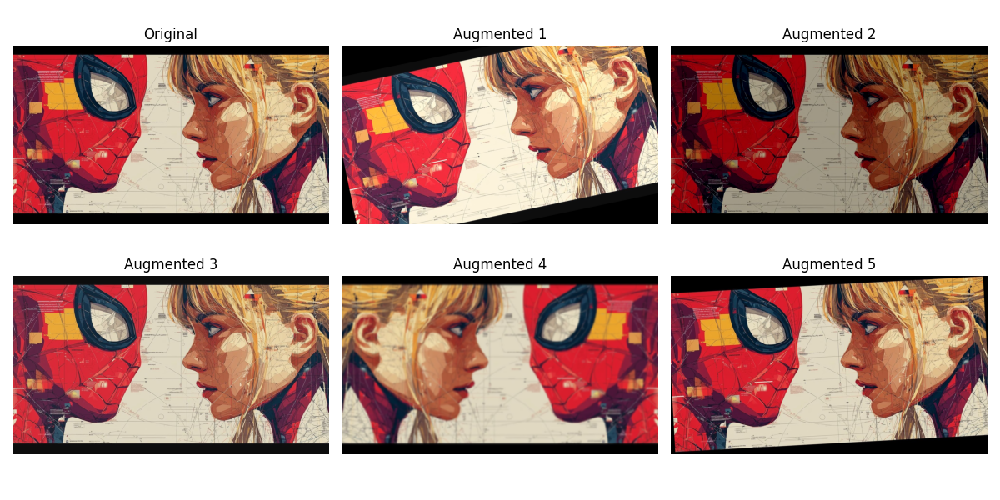

# Data Augmentation Visualization (Albumentations)

## Overview
This project demonstrates how data augmentation increases dataset diversity in computer vision tasks.

## What I did
- Applied transformations like rotation, flip, brightness, and blur
- Generated multiple variations from a single image
- Visualized outputs in a grid format

## Result

## Why it matters
Data augmentation improves model generalization and helps models perform better on real-world data.

## Tools
- Python
- OpenCV
- Albumentations
- Matplotlib
